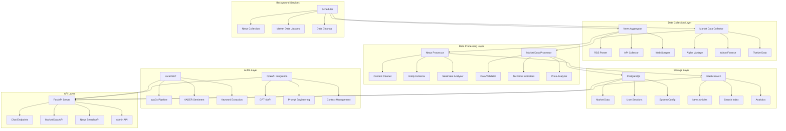

# Trading Chatbot Backend Architecture Plan

## Overview

This document outlines the comprehensive architecture for a Python-based trading chatbot backend that aggregates news from multiple sources, collects market data, and provides intelligent market insights to traders through conversational AI.

## System Requirements

- **Language**: Python 3.13+ with type hints
- **Dependency Management**: uv tool
- **Data Sources**: RSS feeds, APIs, web scraping for news; Alpha Vantage, Yahoo Finance, Twelve Data for market data
- **Database**: Hybrid approach with PostgreSQL for structured data and Elasticsearch for news search
- **AI/ML**: Hybrid approach with local sentiment analysis and OpenAI for complex reasoning

## System Architecture Overview



## Core Components

### 1. Data Collection Layer

#### News Aggregator
- **RSS Parser**: Collects news from Reuters, Bloomberg, MarketWatch RSS feeds
- **API Collector**: Integrates with NewsAPI for real-time financial news
- **Web Scraper**: Extracts content from TradingView, Reddit trading communities
- **Features**:
  - Rate limiting and error handling for each source
  - Duplicate detection and content deduplication
  - Configurable collection intervals
  - Source reliability scoring

#### Market Data Collector
- **Alpha Vantage**: Stocks, forex, and fundamental data
- **Yahoo Finance**: Broad market coverage and historical data
- **Twelve Data**: Cryptocurrency and additional market coverage
- **Features**:
  - Real-time and historical data collection
  - Data validation and anomaly detection
  - Configurable update intervals
  - API quota management

### 2. Data Processing Layer

#### News Processor
- **Content Cleaner**: HTML removal, text normalization, language detection
- **Entity Extractor**: Named Entity Recognition (NER) for tickers, companies, people
- **Sentiment Analyzer**: Local sentiment analysis using VADER and TextBlob
- **Additional Features**:
  - Keyword extraction and topic modeling
  - Content categorization (earnings, mergers, regulatory)
  - Relevance scoring for trading context

#### Market Data Processor
- **Data Validator**: Checks for data integrity and outliers
- **Technical Indicators**: RSI, MACD, Bollinger Bands, Moving Averages
- **Price Analyzer**: Trend detection, support/resistance levels
- **Features**:
  - Real-time calculation of technical indicators
  - Pattern recognition (head and shoulders, triangles)
  - Volume analysis and price action signals

### 3. Storage Architecture

#### PostgreSQL Database
**Tables Structure**:
- `market_quotes`: Real-time and historical price data
- `instruments`: Stock/crypto/forex instrument metadata
- `user_sessions`: Chat sessions and user preferences
- `system_config`: API keys, settings, feature flags
- `technical_indicators`: Calculated indicator values

**Optimization**:
- Time-series partitioning for market data
- Indexes on symbol, timestamp combinations
- Connection pooling and query optimization

#### Elasticsearch
**Indexes**:
- `news_articles`: Full-text searchable news content
- `market_events`: Significant market movements and events
- `chat_analytics`: Query patterns and response analytics

**Features**:
- Real-time search with filters (date, sentiment, entities)
- Aggregations for trend analysis
- Auto-complete for trading terms and symbols

### 4. AI/ML Integration

#### Local NLP Pipeline
- **spaCy**: Advanced linguistic analysis and entity recognition
- **VADER Sentiment**: Financial text sentiment analysis
- **Custom Models**: Trading-specific keyword extraction
- **Benefits**:
  - Fast processing for real-time queries
  - No external API costs for basic NLP
  - Privacy-preserving local processing

#### OpenAI Integration
- **GPT-4 API**: Complex market analysis and reasoning
- **Custom Prompts**: Trading context and market expertise
- **Context Management**: Conversation memory and follow-up questions
- **Features**:
  - Intelligent query understanding
  - Market insight generation
  - Explanation of complex trading concepts
  - Fallback to local processing for cost control

### 5. API Layer (FastAPI)

#### Endpoints Structure
- **Chat Endpoints**: 
  - `POST /chat/message`: Process trader queries
  - `WebSocket /chat/ws`: Real-time chat interface
  - `GET /chat/history`: Conversation history

- **Market Data API**:
  - `GET /market/quote/{symbol}`: Current quote
  - `GET /market/history/{symbol}`: Historical data
  - `GET /market/indicators/{symbol}`: Technical indicators

- **News Search API**:
  - `GET /news/search`: Advanced news search
  - `GET /news/sentiment/{symbol}`: Symbol-specific sentiment
  - `GET /news/trending`: Trending topics and symbols

- **Admin API**:
  - `GET /admin/health`: System health checks
  - `POST /admin/config`: Configuration management
  - `GET /admin/metrics`: Performance metrics

### 6. Background Services

#### Task Scheduling (Celery + Redis)
- **News Collection Tasks**: Scheduled RSS parsing, API calls, web scraping
- **Market Data Updates**: Real-time quote updates, indicator calculations
- **Data Maintenance**: Cleanup old data, index optimization
- **Analytics**: Usage statistics, performance monitoring

#### Job Types
- **High Frequency**: Market data updates (every minute)
- **Medium Frequency**: News collection (every 5-15 minutes)
- **Low Frequency**: Data cleanup, analytics (daily/weekly)

## Project Structure

```
trading-news/
├── src/
│   ├── trading_bot/
│   │   ├── __init__.py
│   │   ├── core/
│   │   │   ├── __init__.py
│   │   │   ├── config.py              # Configuration management
│   │   │   ├── database.py            # Database connections
│   │   │   └── exceptions.py          # Custom exceptions
│   │   ├── data_collection/
│   │   │   ├── __init__.py
│   │   │   ├── news/
│   │   │   │   ├── __init__.py
│   │   │   │   ├── rss_parser.py      # RSS feed parsing
│   │   │   │   ├── api_collector.py   # News API integration
│   │   │   │   └── web_scraper.py     # Web scraping logic
│   │   │   └── market/
│   │   │       ├── __init__.py
│   │   │       ├── alpha_vantage.py   # Alpha Vantage client
│   │   │       ├── yahoo_finance.py   # Yahoo Finance client
│   │   │       └── twelve_data.py     # Twelve Data client
│   │   ├── data_processing/
│   │   │   ├── __init__.py
│   │   │   ├── news_processor.py      # News content processing
│   │   │   ├── market_processor.py    # Market data processing
│   │   │   └── sentiment_analyzer.py  # Sentiment analysis
│   │   ├── storage/
│   │   │   ├── __init__.py
│   │   │   ├── postgres_client.py     # PostgreSQL operations
│   │   │   ├── elasticsearch_client.py # Elasticsearch operations
│   │   │   └── models/
│   │   │       ├── __init__.py
│   │   │       ├── market_data.py     # Market data models
│   │   │       └── news_article.py    # News article models
│   │   ├── ai/
│   │   │   ├── __init__.py
│   │   │   ├── local_nlp.py           # Local NLP processing
│   │   │   ├── openai_client.py       # OpenAI integration
│   │   │   └── insight_generator.py   # Market insight generation
│   │   ├── api/
│   │   │   ├── __init__.py
│   │   │   ├── main.py                # FastAPI application
│   │   │   ├── chat.py                # Chat endpoints
│   │   │   ├── market.py              # Market data endpoints
│   │   │   └── news.py                # News search endpoints
│   │   └── services/
│   │       ├── __init__.py
│   │       ├── scheduler.py           # Task scheduling
│   │       └── background_tasks.py    # Background job definitions
├── tests/
│   ├── unit/
│   ├── integration/
│   └── fixtures/
├── docker/
│   ├── docker-compose.yml             # Development environment
│   ├── Dockerfile                     # Application container
│   └── postgres/
│       └── init.sql                   # Database initialization
├── scripts/
│   ├── setup_db.py                    # Database setup script
│   └── migrate_data.py                # Data migration utilities
├── docs/
│   ├── api.md                         # API documentation
│   └── deployment.md                  # Deployment guide
├── .env.example                       # Environment variables template
├── pyproject.toml                     # Project configuration
└── README.md                          # Project overview
```

## Technology Stack

### Core Dependencies
- **FastAPI**: Modern, fast web framework for building APIs
- **SQLAlchemy**: SQL toolkit and ORM for PostgreSQL
- **Elasticsearch-py**: Official Elasticsearch client
- **Celery**: Distributed task queue for background jobs
- **Redis**: In-memory data store for caching and message broker
- **APScheduler**: Advanced Python scheduler for job scheduling

### Data Collection
- **aiohttp**: Asynchronous HTTP client for API calls
- **BeautifulSoup4**: HTML parsing for web scraping
- **feedparser**: RSS and Atom feed parsing
- **requests**: HTTP library for synchronous requests
- **selenium**: Web browser automation (if needed for complex scraping)

### AI/ML Processing
- **spaCy**: Industrial-strength NLP library
- **openai**: Official OpenAI API client
- **vaderSentiment**: Rule-based sentiment analysis
- **scikit-learn**: Machine learning library for additional ML tasks
- **transformers**: Hugging Face transformers (optional for advanced NLP)
- **numpy**: Numerical computing for data processing
- **pandas**: Data manipulation and analysis

### Development & Testing
- **pytest**: Testing framework
- **pytest-asyncio**: Async testing support
- **black**: Code formatter
- **mypy**: Static type checker
- **pre-commit**: Git hooks for code quality
- **coverage**: Code coverage reporting

## Implementation Phases

### Phase 1: Foundation (Week 1-2)
**Objectives**: Set up project structure and core infrastructure
- [ ] Initialize project with uv and configure pyproject.toml
- [ ] Set up PostgreSQL and Elasticsearch connections
- [ ] Create basic FastAPI server with health checks
- [ ] Implement configuration management system
- [ ] Set up logging and error handling
- [ ] Create database schemas and models

### Phase 2: Data Collection (Week 3-4)
**Objectives**: Implement data collection from all sources
- [ ] Build RSS feed parser for financial news
- [ ] Integrate NewsAPI for real-time news
- [ ] Implement web scraping for additional sources
- [ ] Create market data collectors (Alpha Vantage, Yahoo Finance, Twelve Data)
- [ ] Set up background task scheduling
- [ ] Implement data validation and storage

### Phase 3: Processing & AI (Week 5-6)
**Objectives**: Build data processing and AI capabilities
- [ ] Implement local NLP pipeline with spaCy
- [ ] Build sentiment analysis system
- [ ] Create entity extraction for financial terms
- [ ] Integrate OpenAI API with custom prompts
- [ ] Develop market insight generation logic
- [ ] Implement technical indicator calculations

### Phase 4: Chat Interface (Week 7-8)
**Objectives**: Create conversational AI interface
- [ ] Build chat API endpoints
- [ ] Implement WebSocket for real-time communication
- [ ] Create context management system
- [ ] Develop query processing and response generation
- [ ] Build conversation history and user sessions
- [ ] Implement intelligent query routing

### Phase 5: Optimization & Testing (Week 9-10)
**Objectives**: Optimize performance and ensure reliability
- [ ] Performance optimization and caching
- [ ] Comprehensive unit and integration testing
- [ ] Load testing and scalability improvements
- [ ] Documentation and API specifications
- [ ] Deployment preparation and Docker configuration
- [ ] Monitoring and alerting setup

## Key Features

### 1. Real-time Market Insights
- Combine live market data with recent news sentiment
- Technical analysis with multiple indicators
- Price alerts and significant movement detection
- Market correlation analysis

### 2. Intelligent Query Processing
- Natural language understanding for trading queries
- Context-aware responses based on conversation history
- Multi-turn conversations with follow-up questions
- Query intent classification and routing

### 3. Multi-source Data Aggregation
- Comprehensive news coverage from RSS, APIs, and web scraping
- Multiple market data providers for redundancy
- Data quality scoring and source reliability tracking
- Real-time and historical data integration

### 4. Scalable Architecture
- Microservices-ready design with clear separation of concerns
- Asynchronous processing for high throughput
- Horizontal scaling capabilities
- Load balancing and failover mechanisms

### 5. Cost-effective AI
- Hybrid approach balancing local processing with cloud AI
- Intelligent routing to minimize API costs
- Caching of common queries and responses
- Fallback mechanisms for service unavailability

### 6. Robust Error Handling
- Graceful degradation when external services fail
- Retry mechanisms with exponential backoff
- Circuit breaker pattern for external API calls
- Comprehensive logging and monitoring

### 7. Security & Privacy
- API key management and rotation
- Rate limiting and abuse prevention
- Data encryption at rest and in transit
- User session management and authentication

## Performance Considerations

### Database Optimization
- Time-series partitioning for market data tables
- Proper indexing strategies for fast queries
- Connection pooling and query optimization
- Regular maintenance and cleanup jobs

### Caching Strategy
- Redis for session data and frequently accessed information
- Application-level caching for expensive computations
- CDN for static content and API responses
- Cache invalidation strategies

### Scalability Planning
- Horizontal scaling of API servers
- Database read replicas for query distribution
- Message queue scaling for background tasks
- Monitoring and auto-scaling triggers

## Monitoring & Analytics

### System Monitoring
- Application performance monitoring (APM)
- Database performance and query analysis
- External API response times and error rates
- Resource utilization (CPU, memory, disk)

### Business Analytics
- User query patterns and popular topics
- Market data usage and trending symbols
- News sentiment trends and market correlation
- Chat session analytics and user engagement

## Security Considerations

### API Security
- Rate limiting per user/IP
- API key authentication and authorization
- Input validation and sanitization
- CORS configuration for web clients

### Data Protection
- Encryption of sensitive data at rest
- Secure API key storage and rotation
- Regular security audits and updates
- Compliance with data protection regulations

## Deployment Strategy

### Development Environment
- Docker Compose for local development
- Hot reloading for rapid development
- Test data seeding and fixtures
- Development-specific configurations

### Production Deployment
- Containerized deployment with Docker
- Kubernetes orchestration (optional)
- CI/CD pipeline with automated testing
- Blue-green deployment strategy
- Monitoring and alerting setup

## Future Enhancements

### Advanced Features
- Portfolio tracking and analysis
- Backtesting capabilities for trading strategies
- Social sentiment analysis from Twitter/Reddit
- Voice interface integration
- Mobile app API support

### Machine Learning Improvements
- Custom financial language models
- Predictive analytics for market movements
- Anomaly detection in market data
- Personalized recommendations based on user behavior

### Integration Possibilities
- Trading platform APIs (Interactive Brokers, TD Ameritrade)
- Calendar integration for earnings and events
- Economic indicator tracking
- Cryptocurrency DeFi protocol integration

---

This architecture provides a solid foundation for a comprehensive trading chatbot backend that can scale with growing user demands while maintaining high performance and reliability.