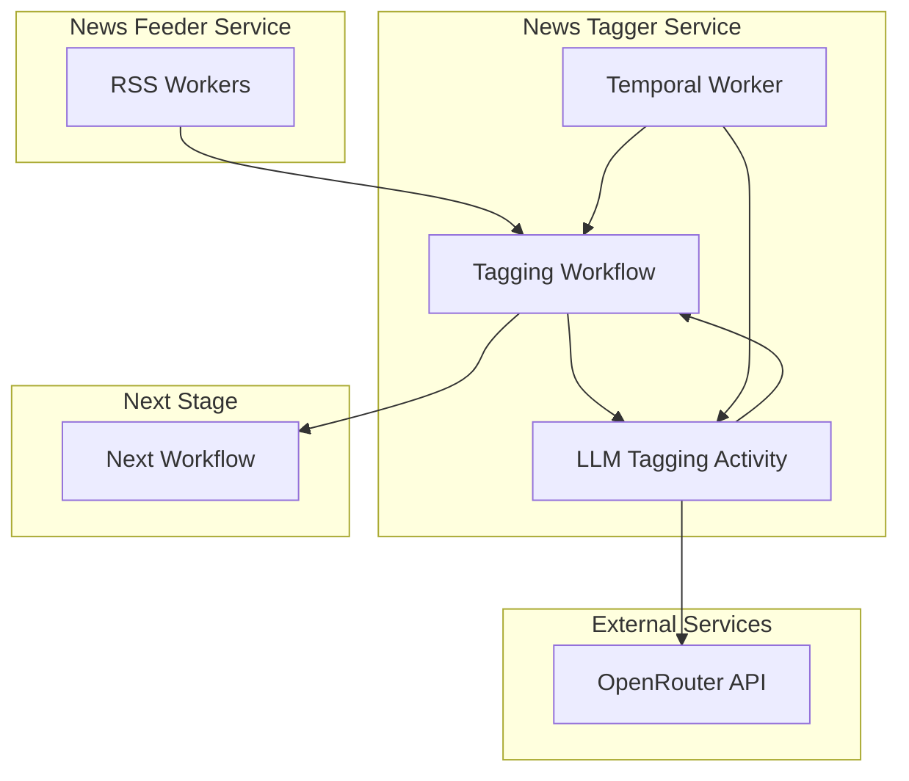

# News Tagger Service

A Temporal-based service that listens for news events from news-feeder workers and uses OpenAI-compatible LLM API (OpenRouter) to add tags to news items before passing them to the next stage in the workflow pipeline.

## Overview

This service implements a Temporal workflow that:
1. Receives news items from the news-feeder service
2. Uses OpenRouter's OpenAI-compatible API to analyze news content
3. Generates relevant tags for each news item
4. Passes tagged news to the next workflow stage

## Architecture



## Features

### LLM Integration
- OpenRouter API integration for OpenAI-compatible models
- Configurable model selection (GPT-4, Claude, etc.)
- Intelligent tag generation based on news content
- Rate limiting and error handling

### Temporal Integration
- Durable workflow execution
- Automatic retries for failed LLM calls
- Scalable worker architecture
- Monitoring and observability

### Tag Generation
- Content-aware tagging
- Trading/finance focused categories
- Configurable tag taxonomies
- Quality filtering

## Project Structure

```
news-tagger/
├── src/
│   ├── models/           # Data models (TaggedNewsItem, TaggerConfig)
│   ├── workflows/        # Temporal workflows
│   ├── activities/       # Temporal activities (LLM tagging)
│   ├── services/         # LLM service integration
│   └── config/           # Configuration management
├── tests/                # Comprehensive test suite
├── scripts/              # Utility and demo scripts
└── README.md
```

## Configuration

```yaml
llm:
  provider: "openrouter"
  api_key: "${OPENROUTER_API_KEY}"
  model: "anthropic/claude-3-haiku"
  max_tokens: 150
  temperature: 0.3

temporal:
  namespace: "news-tagger"
  task_queue: "news-tagging"
  server_url: "localhost:7233"

tagging:
  max_tags: 5
  categories:
    - "finance"
    - "trading"
    - "markets"
    - "economy"
    - "politics"
    - "technology"
```

## Quick Start

### Prerequisites
- Python 3.13+
- Temporal cluster running
- OpenRouter API key

### Setup

1. **Set environment variables**:
   ```bash
   export OPENROUTER_API_KEY="your-api-key"
   ```

2. **Install dependencies**:
   ```bash
   uv sync
   ```

3. **Start the worker**:
   ```bash
   uv run python scripts/start_worker.py
   ```

## Development

### Running Tests
```bash
uv run pytest tests/ -v
```

### Testing with Demo Data
```bash
uv run python scripts/demo_tagger.py
```

## Integration

This service is designed to work as part of the trading-news workflow pipeline:

1. **Input**: Receives `NewsItem` objects from news-feeder service
2. **Processing**: Adds intelligent tags using LLM analysis
3. **Output**: Sends `TaggedNewsItem` objects to next workflow stage

## License

[Add license information]