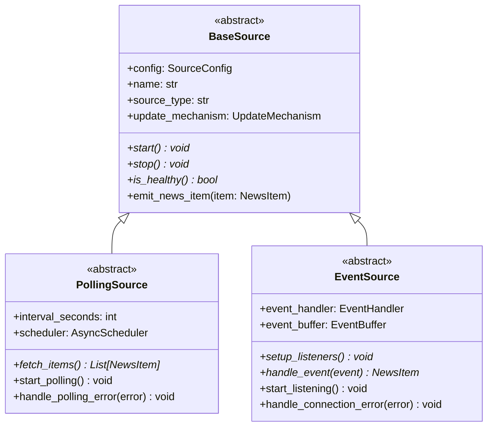
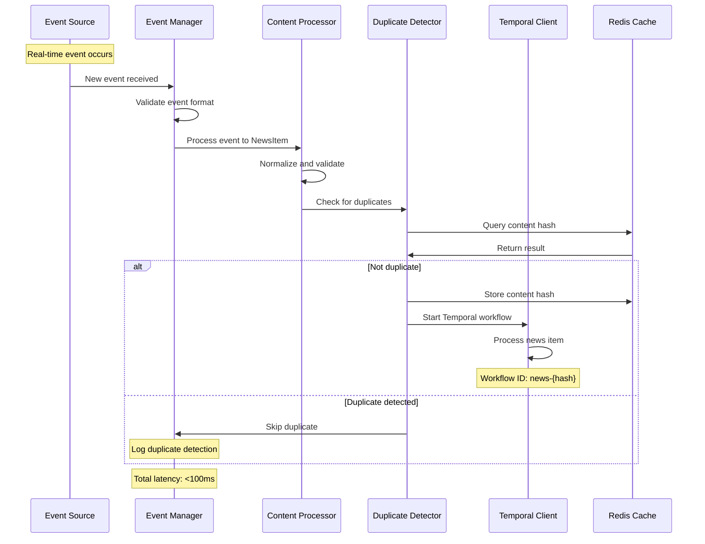
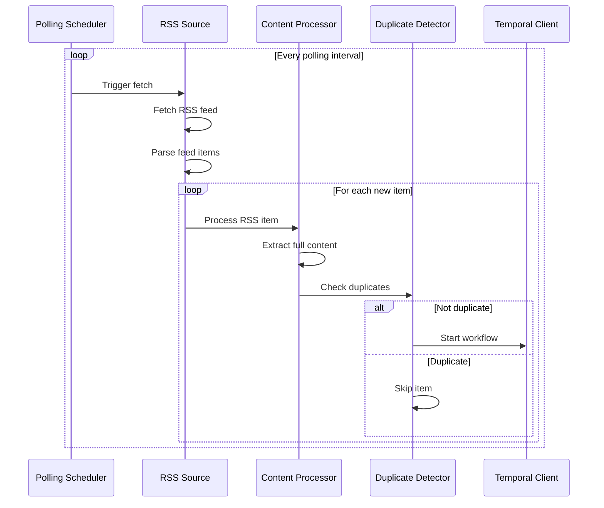

# News Feeder Service Architecture

## System Overview

The News Feeder Service is built on a hybrid architecture that supports both polling-based and event-driven news sources to achieve optimal performance and real-time news delivery.

## Core Architecture Principles

1. **Source Agnostic**: Unified interface for different news source types
2. **Event-Driven First**: Prioritize real-time updates where possible
3. **Polling Fallback**: Reliable polling for sources without event support
4. **Async by Design**: Non-blocking operations for maximum throughput
5. **Fault Tolerant**: Graceful handling of source failures and network issues

## System Components

### 1. News Feeder Orchestrator

The main service coordinator that manages all sources and processing pipelines.

```python
class NewsFeederOrchestrator:
    - source_manager: SourceManager
    - content_processor: ContentProcessor
    - duplicate_detector: DuplicateDetector
    - temporal_client: TemporalClient
    - health_monitor: HealthMonitor
```

**Responsibilities:**
- Initialize and coordinate all service components
- Handle graceful startup and shutdown
- Monitor overall system health
- Coordinate error handling and recovery

### 2. Source Management Layer

#### Source Manager
Manages the lifecycle of all news sources, handling both polling and event-driven sources.

```python
class SourceManager:
    - polling_scheduler: PollingScheduler
    - event_listener_manager: EventListenerManager
    - source_factory: SourceFactory
    - port_manager: PortManager
```

#### Source Factory
Creates appropriate source instances based on configuration.

```python
class SourceFactory:
    def create_source(config: SourceConfig) -> BaseSource:
        # Factory pattern implementation
        # Returns PollingSource or EventSource based on config
```

#### Base Source Architecture



### 3. Source Implementations

#### RSS Source (Polling)
```python
class RSSSource(PollingSource):
    - feed_parser: FeedParser
    - content_extractor: ContentExtractor
    - last_modified: Optional[str]
    - etag: Optional[str]
```

**Features:**
- Supports RSS 2.0, Atom 1.0, and RDF feeds
- Conditional requests using ETag and Last-Modified headers
- Full content extraction when configured
- Handles feed parsing errors gracefully

#### Telegram Event Source
```python
class TelegramEventSource(EventSource):
    - client: TelegramClient
    - channel_entities: List[Entity]
    - message_buffer: MessageBuffer
```

**Features:**
- Real-time message monitoring using Telegram API
- Handles media content (photos, documents, links)
- Automatic reconnection on connection loss
- Rate limiting compliance

#### WebSocket Source
```python
class WebSocketSource(EventSource):
    - websocket_client: WebSocketClient
    - reconnect_strategy: ReconnectStrategy
    - message_parser: MessageParser
```

**Features:**
- Persistent WebSocket connections
- Automatic reconnection with exponential backoff
- Message format validation
- Connection health monitoring

#### Webhook Source
```python
class WebhookSource(EventSource):
    - webhook_server: FastAPI
    - auth_handler: AuthHandler
    - request_validator: RequestValidator
```

**Features:**
- HTTP webhook endpoint
- Authentication and authorization
- Request validation and sanitization
- Async request handling

### 4. Content Processing Pipeline

#### Content Processor
Normalizes content from different sources into a unified format.

```python
class ContentProcessor:
    - content_normalizer: ContentNormalizer
    - metadata_extractor: MetadataExtractor
    - content_validator: ContentValidator
```

**Processing Steps:**
1. **Normalization**: Convert source-specific data to NewsItem format
2. **Validation**: Ensure required fields are present and valid
3. **Enhancement**: Extract additional metadata when possible
4. **Sanitization**: Clean and validate content for security

#### News Item Model
```python
@dataclass
class NewsItem:
    title: str
    description: str
    link: str
    publication_date: datetime
    source_name: str
    source_type: str
    author: Optional[str] = None
    categories: List[str] = field(default_factory=list)
    full_content: Optional[str] = None
    media_urls: List[str] = field(default_factory=list)
    content_hash: str = ""
    extracted_at: datetime = field(default_factory=datetime.now)
    raw_data: Dict[str, Any] = field(default_factory=dict)
```

### 5. Duplicate Detection System

#### Duplicate Detector
Prevents processing of duplicate news items across sources.

```python
class DuplicateDetector:
    - redis_client: RedisClient
    - hash_generator: ContentHashGenerator
    - ttl_manager: TTLManager
```

**Hash Generation Strategy:**
- Primary hash: SHA-256 of (title + link + publication_date)
- Secondary hash: SHA-256 of content similarity
- Fuzzy matching for near-duplicates

**Redis Storage:**
```
Key: "news:hash:{content_hash}"
Value: {
    "source_name": str,
    "processed_at": timestamp,
    "workflow_id": str
}
TTL: 30 days (configurable)
```

### 6. Temporal Integration

#### Workflow Starter
Initiates Temporal workflows for each new news item.

```python
class WorkflowStarter:
    - temporal_client: Client
    - workflow_config: WorkflowConfig
    - retry_policy: RetryPolicy
```

**Workflow Triggering:**
```python
async def start_news_processing_workflow(news_item: NewsItem):
    workflow_id = f"news-{news_item.content_hash}"
    
    await client.start_workflow(
        NewsProcessingWorkflow.run,
        news_item,
        id=workflow_id,
        task_queue="news-processing",
        retry_policy=RetryPolicy(
            initial_interval=timedelta(seconds=1),
            maximum_interval=timedelta(minutes=5),
            maximum_attempts=3
        )
    )
```

## Data Flow Architecture

### Event-Driven Flow


### Polling Flow


## Performance Characteristics

### Latency Targets
- **Event Sources**: < 100ms from event to workflow start
- **Polling Sources**: < 30 seconds from content availability
- **Duplicate Detection**: < 10ms per item
- **Content Processing**: < 500ms per item

### Throughput Targets
- **Event Sources**: 1000+ items/second
- **Polling Sources**: 100+ items/minute per source
- **Concurrent Sources**: 50+ sources per instance

### Resource Usage
- **Memory**: < 512MB per instance
- **CPU**: < 50% under normal load
- **Network**: Minimal bandwidth usage with conditional requests

## Scalability Design

### Horizontal Scaling
- **Source Distribution**: Each instance handles subset of sources
- **Load Balancing**: Sources distributed by type and load
- **State Sharing**: Redis for shared duplicate detection

### Vertical Scaling
- **Async Architecture**: Non-blocking I/O operations
- **Connection Pooling**: Reuse HTTP/WebSocket connections
- **Batch Processing**: Group operations where possible

## Error Handling Strategy

### Source-Level Errors
- **Network Failures**: Exponential backoff retry
- **Parse Errors**: Log and skip malformed content
- **Rate Limiting**: Respect source rate limits

### System-Level Errors
- **Redis Unavailable**: Graceful degradation without duplicate detection
- **Temporal Unavailable**: Queue items for retry
- **Memory Pressure**: Implement backpressure mechanisms

### Recovery Mechanisms
- **Graceful Shutdown**: Complete in-flight operations
- **State Recovery**: Resume from last known state
- **Health Monitoring**: Automatic restart on critical failures

## Security Considerations

### Input Validation
- **Content Sanitization**: Remove potentially harmful content
- **URL Validation**: Verify source URLs and prevent SSRF
- **Size Limits**: Enforce maximum content size

### Authentication
- **API Keys**: Secure storage of source credentials
- **Webhook Authentication**: Verify webhook authenticity
- **TLS**: Encrypted connections for all external communication

### Data Privacy
- **Content Filtering**: Remove sensitive information
- **Audit Logging**: Track all data processing activities
- **Retention Policies**: Automatic cleanup of old data

## Monitoring and Observability

### Metrics Collection
- **Source Metrics**: Items processed, errors, latency
- **System Metrics**: Memory, CPU, network usage
- **Business Metrics**: Duplicate rate, workflow success rate

### Health Checks
- **Source Health**: Individual source availability
- **System Health**: Overall service status
- **Dependency Health**: Redis, Temporal connectivity

### Logging Strategy
- **Structured Logging**: JSON format with correlation IDs
- **Log Levels**: DEBUG, INFO, WARN, ERROR, CRITICAL
- **Log Aggregation**: Centralized logging for analysis

This architecture provides a robust, scalable, and maintainable foundation for real-time news aggregation and processing.