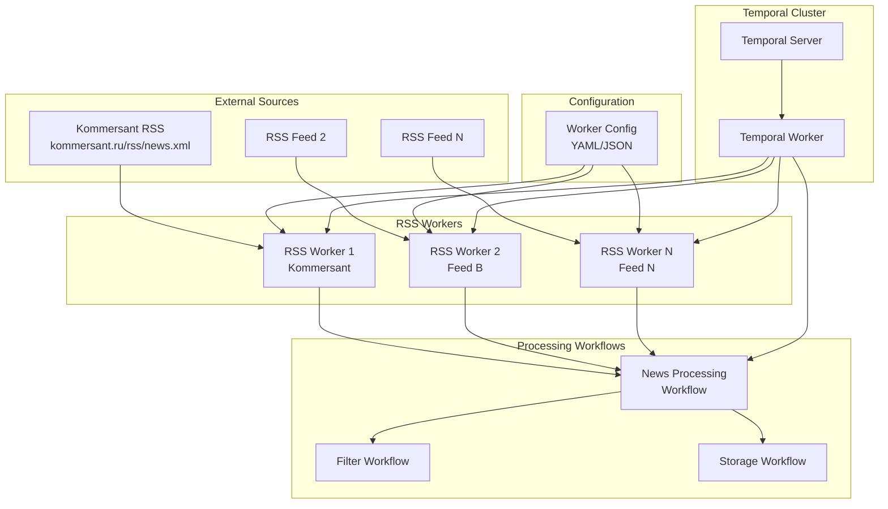
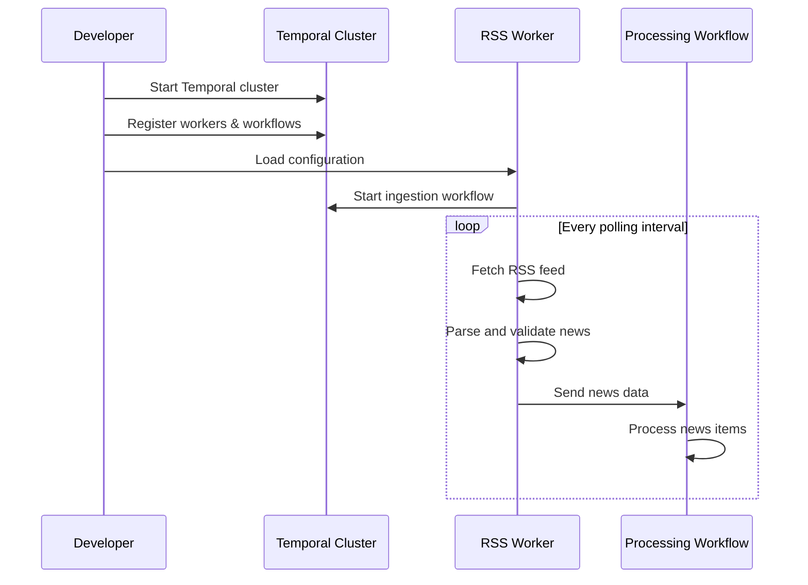

# News Feeder Service

A Temporal-based news aggregation service that pulls news from RSS feeds and sends data to processing workflows.

## Overview

This service implements a scalable news ingestion system using Temporal workflows where RSS workers pull news data and send it to processing workflows. The service is designed for extensibility to support multiple feed types in the future.

## Architecture



## Project Structure

```
news-feeder/
├── src/
│   ├── __init__.py
│   ├── temporal_client.py          # Temporal client setup
│   ├── workers/
│   │   ├── __init__.py
│   │   ├── base_worker.py          # Abstract base worker
│   │   ├── rss_worker.py           # RSS-specific worker
│   │   └── worker_factory.py       # Factory for creating workers
│   ├── workflows/
│   │   ├── __init__.py
│   │   ├── news_ingestion.py       # Main ingestion workflow
│   │   └── news_processing.py      # News processing workflow
│   ├── activities/
│   │   ├── __init__.py
│   │   ├── rss_activities.py       # RSS fetching activities
│   │   └── processing_activities.py # News processing activities
│   ├── models/
│   │   ├── __init__.py
│   │   ├── news_item.py            # News data models
│   │   └── worker_config.py        # Configuration models
│   └── config/
│       ├── __init__.py
│       ├── settings.py             # Application settings
│       └── worker_configs.yaml     # Worker configurations
├── tests/
│   ├── __init__.py
│   ├── test_workers.py
│   ├── test_workflows.py
│   └── test_activities.py
├── docs/
│   ├── architecture.md
│   ├── deployment.md
│   └── temporal_concepts.md
├── scripts/
│   ├── start_worker.py             # Worker startup script
│   ├── start_workflows.py          # Workflow starter
│   └── setup_temporal.py          # Temporal setup helper
├── docker/
│   ├── docker-compose.yml          # Temporal + dependencies
│   └── Dockerfile                  # Application container
├── requirements.txt
├── pyproject.toml
└── README.md
```

## Key Features

### Temporal Integration
- **Workflows**: Long-running, reliable orchestration of news ingestion
- **Activities**: Individual tasks (RSS fetching, processing, validation)
- **Workers**: Execute workflows and activities with automatic scaling
- **Signals**: Dynamic workflow control (pause/resume workers)
- **Queries**: Real-time workflow state inspection and monitoring
- **Schedules**: Cron-like scheduling for periodic news fetching

### Extensibility
- **Plugin architecture**: Easy addition of new feed types (Telegram, Twitter, etc.)
- **Configuration-driven**: Add new feeds without code changes
- **Modular workflows**: Separate concerns for ingestion vs processing
- **Type safety**: Strong typing with Pydantic models

### Reliability
- **Automatic retries**: Temporal handles transient network failures
- **Durable execution**: Workflows survive process restarts
- **Monitoring**: Built-in observability with metrics and tracing
- **Graceful degradation**: Individual worker failures don't affect others

## Configuration

Workers are configured via YAML files in `src/config/worker_configs.yaml`:

```yaml
workers:
  - name: "kommersant_news"
    type: "rss"
    config:
      url: "https://www.kommersant.ru/rss/news.xml"
      polling_interval: "5m"
      worker_id: "kommersant_001"
      timeout: "30s"
      max_retries: 3
  
  - name: "reuters_business"
    type: "rss"
    config:
      url: "https://feeds.reuters.com/reuters/businessNews"
      polling_interval: "3m"
      worker_id: "reuters_business_001"
      timeout: "30s"
      max_retries: 3

temporal:
  namespace: "news-feeder"
  task_queue: "news-ingestion"
  server_url: "localhost:7233"

processing:
  batch_size: 10
  processing_workflow: "news-processing"
  target_queue: "news-processing"
```

## Quick Start

### Prerequisites
- Python 3.9+
- Docker and Docker Compose
- Temporal CLI (optional, for development)

### Setup

1. **Start Temporal cluster**:
   ```bash
   cd docker
   docker-compose up -d
   ```

2. **Install dependencies**:
   ```bash
   pip install -r requirements.txt
   ```

3. **Start the worker**:
   ```bash
   python scripts/start_worker.py
   ```

4. **Start workflows**:
   ```bash
   python scripts/start_workflows.py
   ```

### Development

1. **Run tests**:
   ```bash
   pytest tests/
   ```

2. **Check workflow status**:
   ```bash
   temporal workflow list --namespace news-feeder
   ```

## Temporal Concepts

### What is Temporal?
Temporal is a workflow orchestration platform that ensures reliable execution of distributed applications. It provides durable execution, automatic retries, complete visibility, and horizontal scalability.

### Key Components:
- **Temporal Server**: Core orchestration engine
- **Workers**: Processes that execute workflow and activity code
- **Workflows**: Durable functions that coordinate activities
- **Activities**: Individual tasks that interact with external systems
- **Task Queues**: Routing mechanism for distributing work

### Benefits for News Ingestion:
- **Reliability**: Handles unreliable RSS feeds gracefully
- **Scheduling**: Built-in cron-like scheduling for periodic fetching
- **Monitoring**: Real-time visibility into feed status
- **Scalability**: Easy horizontal scaling as sources grow
- **Maintainability**: Clear separation of concerns

## Development Workflow



## Implementation Phases (TDD Approach)

### Phase 1: Foundation (Test-Driven)
- [ ] **Models & Data Structures**
  - [ ] Write tests for NewsItem model
  - [ ] Implement NewsItem model
  - [ ] Write tests for WorkerConfig model
  - [ ] Implement WorkerConfig model
- [ ] **Temporal Client Setup**
  - [ ] Write tests for temporal client connection
  - [ ] Implement temporal client setup
  - [ ] Write integration tests for client

### Phase 2: Core Workers (Test-Driven)
- [ ] **Abstract Base Worker**
  - [ ] Write tests for base worker interface
  - [ ] Implement abstract base worker class
  - [ ] Write tests for configuration handling
- [ ] **RSS Worker Implementation**
  - [ ] Write tests for RSS parsing logic
  - [ ] Implement RSS worker
  - [ ] Write tests for polling mechanism
  - [ ] Write integration tests with real RSS feeds
- [ ] **Worker Factory**
  - [ ] Write tests for worker factory pattern
  - [ ] Implement worker factory
  - [ ] Write tests for dynamic worker creation

### Phase 3: Workflows & Activities (Test-Driven)
- [ ] **Activities Implementation**
  - [ ] Write tests for RSS fetching activities
  - [ ] Implement RSS activities
  - [ ] Write tests for processing activities
  - [ ] Implement processing activities
- [ ] **Workflows Implementation**
  - [ ] Write tests for news ingestion workflow
  - [ ] Implement news ingestion workflow
  - [ ] Write tests for news processing workflow
  - [ ] Implement news processing workflow
- [ ] **Integration Testing**
  - [ ] Write end-to-end workflow tests
  - [ ] Test workflow orchestration

### Phase 4: Deployment & Configuration (Test-Driven)
- [ ] **Configuration System**
  - [ ] Write tests for configuration loading
  - [ ] Implement configuration system
  - [ ] Write tests for validation
- [ ] **Startup Scripts**
  - [ ] Write tests for worker startup
  - [ ] Implement startup scripts
  - [ ] Write tests for graceful shutdown
- [ ] **Docker & Deployment**
  - [ ] Write tests for containerization
  - [ ] Implement Docker setup
  - [ ] Write integration tests for full deployment

## TDD Development Workflow

Each module follows this Test-Driven Development cycle:

1. **Red**: Write a failing test that describes the desired functionality
2. **Green**: Write the minimal code to make the test pass
3. **Refactor**: Improve the code while keeping tests green
4. **Repeat**: Move to the next piece of functionality

### Testing Strategy
- **Unit Tests**: Test individual components in isolation
- **Integration Tests**: Test component interactions
- **End-to-End Tests**: Test complete workflows
- **Mock External Dependencies**: Use mocks for RSS feeds, Temporal server during unit tests
- **Test Coverage**: Aim for >90% code coverage

## Contributing

1. Follow the existing code structure
2. Add tests for new functionality
3. Update documentation as needed
4. Ensure type hints are used throughout

## License

[Add license information]