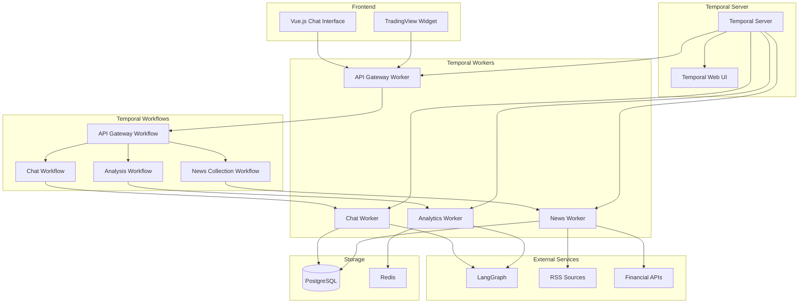

# Архитектура чат-бота для трейдеров

## Обзор проекта

Чат-бот для трейдеров - это MVP решение для хакатона, предназначенное для сбора, анализа и пересказа финансовых новостей из проверенных источников. Система построена на базе Temporal как основной платформы для управления workflow и сервисами.

## Основная концепция

Минимально жизнеспособный продукт (MVP) с упрощенной архитектурой, использующий Temporal в качестве центральной платформы для всех сервисов и бизнес-логики.

## Архитектурная диаграмма



## Компоненты системы

### 1. Frontend Layer

#### Vue.js Chat Interface
- **Назначение**: Основной пользовательский интерфейс
- **Функции**:
  - Чат-интерфейс для общения с ботом
  - Отображение истории диалогов
  - Настройки пользователя
  - Real-time обновления через WebSocket

#### TradingView Widget
- **Назначение**: Отображение финансовых графиков
- **Функции**:
  - Простые графики цен акций
  - Базовые технические индикаторы
  - Интеграция с чат-ботом для анализа

### 2. Temporal Core

#### Temporal Server
- **Назначение**: Центральная платформа для управления workflow
- **Функции**:
  - Оркестрация всех бизнес-процессов
  - Надежное выполнение задач
  - Мониторинг и наблюдаемость
  - Автоматические retry и error handling

#### Temporal Web UI
- **Назначение**: Интерфейс для мониторинга workflow
- **Функции**:
  - Визуализация выполнения workflow
  - Отладка и диагностика
  - Мониторинг производительности

### 3. Temporal Workers

#### Chat Worker
- **Назначение**: Обработка пользовательских сообщений
- **Функции**:
  - Получение и обработка чат-запросов
  - Интеграция с LangGraph для генерации ответов
  - Управление контекстом диалога
  - Сохранение истории чатов

#### News Worker
- **Назначение**: Сбор и обработка новостей
- **Функции**:
  - Парсинг RSS-лент финансовых сайтов
  - Получение данных из Financial APIs
  - Дедупликация новостей
  - Анализ настроений новостей

#### Analytics Worker
- **Назначение**: Аналитическая обработка данных
- **Функции**:
  - Генерация инсайтов на основе новостей
  - Простые рекомендации для трейдеров
  - Кэширование аналитических результатов
  - Агрегация данных

#### API Gateway Worker
- **Назначение**: Обработка HTTP/WebSocket запросов
- **Функции**:
  - HTTP API сервер
  - WebSocket соединения для real-time
  - Маршрутизация запросов к workflow
  - Базовая аутентификация

### 4. Temporal Workflows

#### API Gateway Workflow
```python
@workflow.defn
class APIGatewayWorkflow:
    @workflow.run
    async def run(self, request: APIRequest) -> APIResponse:
        # Маршрутизация запросов к соответствующим workflow
        if request.type == "chat":
            return await workflow.execute_child_workflow(ChatWorkflow.run, request)
        elif request.type == "news":
            return await workflow.execute_child_workflow(NewsWorkflow.run, request)
        elif request.type == "analytics":
            return await workflow.execute_child_workflow(AnalyticsWorkflow.run, request)
```

#### Chat Workflow
```python
@workflow.defn
class ChatWorkflow:
    @workflow.run
    async def run(self, chat_request: ChatRequest) -> ChatResponse:
        # 1. Получение контекста пользователя
        user_context = await workflow.execute_activity(
            get_user_context, chat_request.user_id
        )
        
        # 2. Получение релевантных новостей
        relevant_news = await workflow.execute_activity(
            get_relevant_news, chat_request.message
        )
        
        # 3. Генерация ответа через LangGraph
        response = await workflow.execute_activity(
            generate_chat_response, 
            chat_request.message, 
            user_context, 
            relevant_news
        )
        
        # 4. Сохранение в историю
        await workflow.execute_activity(
            save_chat_history, chat_request, response
        )
        
        return ChatResponse(message=response)
```

#### News Collection Workflow
```python
@workflow.defn
class NewsCollectionWorkflow:
    @workflow.run
    async def run(self) -> None:
        # Периодический сбор новостей каждые 15 минут
        while True:
            # 1. Сбор из RSS источников
            rss_news = await workflow.execute_activity(collect_rss_news)
            
            # 2. Сбор из Financial APIs
            api_news = await workflow.execute_activity(collect_api_news)
            
            # 3. Дедупликация и обработка
            processed_news = await workflow.execute_activity(
                process_and_deduplicate, rss_news + api_news
            )
            
            # 4. Анализ настроений
            for news_item in processed_news:
                sentiment = await workflow.execute_activity(
                    analyze_sentiment, news_item.content
                )
                news_item.sentiment_score = sentiment
            
            # 5. Сохранение в БД
            await workflow.execute_activity(save_news, processed_news)
            
            # Ожидание 15 минут
            await asyncio.sleep(900)
```

#### Analytics Workflow
```python
@workflow.defn
class AnalyticsWorkflow:
    @workflow.run
    async def run(self, analytics_request: AnalyticsRequest) -> AnalyticsResponse:
        # 1. Получение данных для анализа
        market_data = await workflow.execute_activity(
            get_market_data, analytics_request.symbols
        )
        
        # 2. Получение релевантных новостей
        news_data = await workflow.execute_activity(
            get_news_for_symbols, analytics_request.symbols
        )
        
        # 3. Генерация аналитики через LangGraph
        analysis = await workflow.execute_activity(
            generate_market_analysis, market_data, news_data
        )
        
        # 4. Кэширование результата
        await workflow.execute_activity(
            cache_analysis, analytics_request, analysis
        )
        
        return AnalyticsResponse(analysis=analysis)
```

### 5. External Services

#### LangGraph
- **Назначение**: AI-движок для обработки естественного языка
- **Функции**:
  - Граф состояний для сложных AI workflow
  - Интеграция с LLM (OpenAI/Anthropic)
  - Контекстное понимание финансовых запросов
  - Генерация персонализированных ответов

#### RSS Sources
- **Источники**:
  - CNBC RSS feeds
  - MarketWatch RSS feeds
  - Reuters financial news
  - Bloomberg (если доступно)

#### Financial APIs
- **Alpha Vantage**: Бесплатные котировки акций
- **Yahoo Finance API**: Дополнительные рыночные данные
- **Polygon.io**: Real-time данные (если нужно)

### 6. Storage Layer

#### PostgreSQL
- **Назначение**: Основная база данных
- **Схема**:
  ```sql
  -- Пользователи
  CREATE TABLE users (
      id SERIAL PRIMARY KEY,
      username VARCHAR(50) UNIQUE NOT NULL,
      preferences JSONB,
      created_at TIMESTAMP DEFAULT CURRENT_TIMESTAMP
  );
  
  -- Новости
  CREATE TABLE news (
      id SERIAL PRIMARY KEY,
      title TEXT NOT NULL,
      content TEXT,
      source VARCHAR(100),
      url TEXT UNIQUE,
      sentiment_score FLOAT,
      symbols TEXT[],
      created_at TIMESTAMP DEFAULT CURRENT_TIMESTAMP
  );
  
  -- История чатов
  CREATE TABLE chats (
      id SERIAL PRIMARY KEY,
      user_id INTEGER REFERENCES users(id),
      message TEXT NOT NULL,
      response TEXT,
      context JSONB,
      created_at TIMESTAMP DEFAULT CURRENT_TIMESTAMP
  );
  ```

#### Redis Cache
- **Назначение**: Кэширование и временное хранение
- **Использование**:
  - Кэш аналитических результатов
  - Сессии пользователей
  - Временные данные для workflow
  - Rate limiting данные

## Temporal Activities

### News Activities
```python
@activity.defn
async def collect_rss_news() -> List[NewsItem]:
    """Сбор новостей из RSS источников"""
    
@activity.defn
async def collect_api_news() -> List[NewsItem]:
    """Сбор новостей из Financial APIs"""
    
@activity.defn
async def analyze_sentiment(text: str) -> float:
    """Анализ настроений текста"""
    
@activity.defn
async def process_and_deduplicate(news_items: List[NewsItem]) -> List[NewsItem]:
    """Обработка и дедупликация новостей"""
```

### Chat Activities
```python
@activity.defn
async def get_user_context(user_id: int) -> UserContext:
    """Получение контекста пользователя"""
    
@activity.defn
async def get_relevant_news(query: str) -> List[NewsItem]:
    """Поиск релевантных новостей"""
    
@activity.defn
async def generate_chat_response(message: str, context: str, news: List[NewsItem]) -> str:
    """Генерация ответа через LangGraph"""
    
@activity.defn
async def save_chat_history(request: ChatRequest, response: str) -> None:
    """Сохранение истории чата"""
```

### Analytics Activities
```python
@activity.defn
async def get_market_data(symbols: List[str]) -> MarketData:
    """Получение рыночных данных"""
    
@activity.defn
async def generate_market_analysis(market_data: MarketData, news: List[NewsItem]) -> str:
    """Генерация рыночного анализа"""
    
@activity.defn
async def cache_analysis(request: AnalyticsRequest, analysis: str) -> None:
    """Кэширование результатов анализа"""
```

## Преимущества Temporal-центричной архитектуры

### 1. Надежность
- **Автоматические retry**: Temporal автоматически повторяет неудачные операции
- **Durability**: Состояние workflow сохраняется и восстанавливается
- **Error handling**: Встроенная обработка ошибок и исключений

### 2. Наблюдаемость
- **Temporal Web UI**: Визуализация всех workflow
- **Детальное логирование**: Каждый шаг workflow логируется
- **Метрики**: Встроенные метрики производительности

### 3. Масштабируемость
- **Горизонтальное масштабирование**: Легко добавлять новые workers
- **Load balancing**: Автоматическое распределение нагрузки
- **Resource management**: Эффективное использование ресурсов

### 4. Тестируемость
- **Unit testing**: Тестирование отдельных activities
- **Integration testing**: Тестирование целых workflow
- **Time travel**: Возможность "перемотки" времени для тестов

### 5. Версионирование
- **Backward compatibility**: Безопасное обновление workflow
- **Gradual rollout**: Постепенное развертывание новых версий
- **Rollback**: Возможность отката к предыдущим версиям

## Структура проекта

```
trading-news/
├── temporal_app/
│   ├── workflows/
│   │   ├── __init__.py
│   │   ├── chat_workflow.py
│   │   ├── news_workflow.py
│   │   ├── analytics_workflow.py
│   │   └── api_gateway_workflow.py
│   ├── workers/
│   │   ├── __init__.py
│   │   ├── chat_worker.py
│   │   ├── news_worker.py
│   │   ├── analytics_worker.py
│   │   └── api_worker.py
│   ├── activities/
│   │   ├── __init__.py
│   │   ├── news_activities.py
│   │   ├── chat_activities.py
│   │   └── analytics_activities.py
│   ├── models/
│   │   ├── __init__.py
│   │   ├── chat_models.py
│   │   ├── news_models.py
│   │   └── analytics_models.py
│   ├── config/
│   │   ├── __init__.py
│   │   ├── settings.py
│   │   └── database.py
│   ├── utils/
│   │   ├── __init__.py
│   │   ├── logging.py
│   │   └── helpers.py
│   └── worker_main.py
├── langgraph_service/
│   ├── main.py
│   ├── graph_config.py
│   ├── nodes/
│   └── requirements.txt
├── frontend/
│   ├── src/
│   │   ├── components/
│   │   ├── views/
│   │   ├── services/
│   │   └── main.js
│   ├── package.json
│   └── vite.config.js
├── wiki/
│   ├── architecture.md
│   ├── deployment.md
│   └── technical.md
├── docker-compose.yml
├── requirements.txt
└── README.md
```

## Технологический стек

### Core Technologies
- **Temporal**: Основная платформа для workflow
- **Python 3.11**: Язык разработки backend
- **temporalio**: Python SDK для Temporal

### AI/ML Stack
- **LangGraph**: AI workflow engine
- **OpenAI API**: Large Language Model
- **TextBlob/VADER**: Анализ настроений

### Data Storage
- **PostgreSQL**: Основная реляционная БД
- **Redis**: Кэширование и временное хранение

### Frontend
- **Vue.js 3**: Frontend фреймворк
- **TradingView Charting Library**: Финансовые графики
- **WebSocket**: Real-time коммуникация

### Infrastructure
- **Docker**: Контейнеризация
- **Docker Compose**: Локальная оркестрация
- **Nginx**: Reverse proxy (опционально)

## Безопасность

### Аутентификация
- JWT токены для API доступа
- Базовая аутентификация пользователей
- Rate limiting для предотвращения злоупотреблений

### Данные
- Шифрование паролей
- Валидация входных данных
- SQL injection защита через ORM

### API Security
- CORS настройки
- API key management для внешних сервисов
- Request/Response логирование

## Мониторинг и логирование

### Temporal Monitoring
- Встроенный Temporal Web UI
- Метрики workflow выполнения
- Alerting на основе статуса workflow

### Application Monitoring
- Структурированное логирование
- Error tracking
- Performance metrics

### Infrastructure Monitoring
- Docker containers health checks
- Database connection monitoring
- Redis cache metrics

Эта архитектура обеспечивает надежную, масштабируемую и легко поддерживаемую основу для MVP чат-бота трейдеров с возможностью дальнейшего развития в полноценное корпоративное решение.